# Deploy a Static Website on AWS S3 + CloudFront Using GitHub Actions & OIDC  
## A step-by-step guide to a fully automated, serverless CI/CD pipeline — no AWS credentials stored in GitHub  
## AWS  |  S3  |  CloudFront  |  GitHub Actions  |  OIDC  |  DevOps  

## Introduction  
Deploying a static website to AWS should be fast, repeatable, and — most importantly — secure. In this guide I walk through every step needed to host a static site on Amazon S3 served through CloudFront as a CDN, and then wire up an automated CI/CD pipeline with GitHub Actions that uses OIDC (OpenID Connect) so no long-lived AWS credentials ever touch your repository.  

By the end of this tutorial you will have:  
•	An S3 bucket that stores your site and is not publicly accessible on its own  
•	A CloudFront distribution that serves your content globally over HTTPS  
•	An IAM OIDC identity provider and role that lets GitHub Actions assume AWS permissions on demand  
•	A GitHub Actions workflow that automatically syncs your site to S3 and invalidates the CloudFront cache on every push to main  
• A serverless architechture static website using AWS S3 bucket and AWS CloudFront as Content Delivery Network (CDN)

**Prerequisites**  
•	An AWS account with permissions to create S3 buckets, CloudFront distributions, and IAM roles  
•	A GitHub account and a repository for your static site  
•	Basic familiarity with Git and the AWS Console  

**Overview — 5 Steps**  
We will cover the following five steps, each building on the previous one:  
1.	Create the S3 Bucket — private storage for your website files  
2.	Create the CloudFront Distribution — CDN that securely serves the bucket content  
3.	Set Up the IAM OIDC Identity Provider & Role — passwordless authentication for GitHub Actions  
4.	Configure GitHub Actions Secrets — supply deployment parameters to the workflow  
5.	Deploy a simple html static website that displays an image — push to GitHub and watch the pipeline run  

**Here is the repository: https://github.com/ucheor/Serverless_Static_Website_CI-CD_with_GitHub-Actions_AWS_S3_CloudFront_QR.git**

## Step 1 — Create the S3 Bucket  
Amazon S3 (Simple Storage Service) will hold all of your website's HTML, CSS, JavaScript, and asset files. Because CloudFront will serve the files publicly, the bucket itself can — and should — remain private.  

**1.1 — Name and configure the bucket**  
Navigate to S3 in the AWS Console and click Create bucket. Give it a meaningful, globally unique name (e.g. my-static-site). Select your desired AWS Region — all subsequent resources should ideally live in the same region to minimise latency. Keep the bucket type as General purpose and leave Object Ownership at ACLs disabled (recommended).  

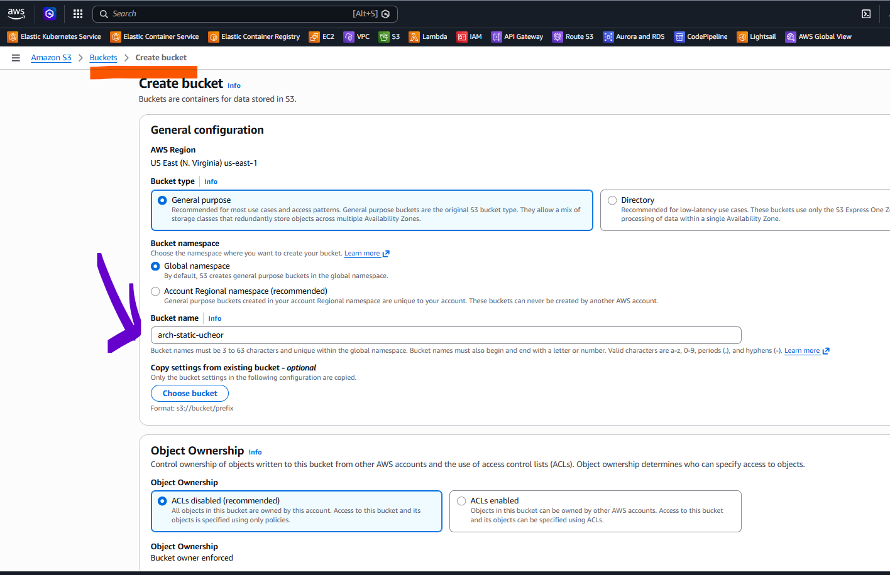  

---

**1.2 — Block all public access & enable versioning**   
Scroll down to Block Public Access settings and make sure Block all public access is checked. This is a security best practice — CloudFront will be granted private access to the bucket, so direct public access is unnecessary and potentially dangerous.   

While still on the creation form, scroll further to Bucket Versioning and select Enable. Versioning lets you roll back to a previous version of any file if a bad deployment is pushed.   

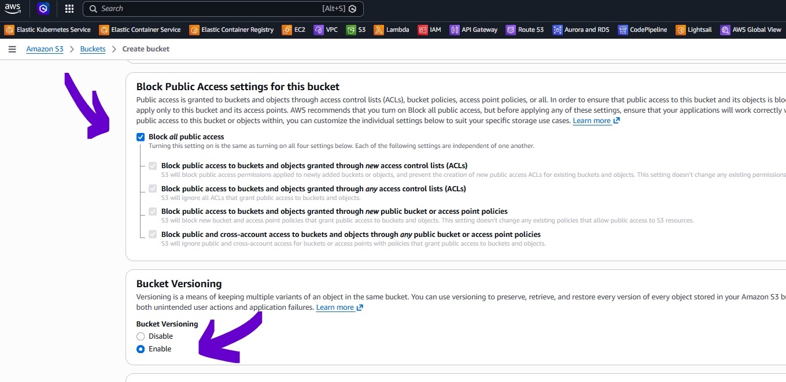  

---

Click Create bucket. You should see a success banner.   

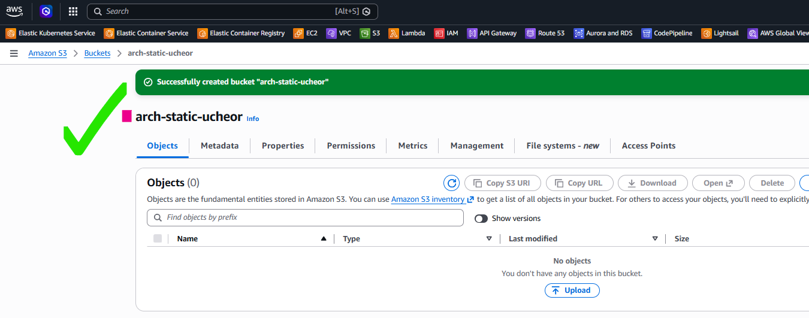   

---

**Tip:** Your bucket name will appear in the CloudFront origin URL, so choose something descriptive. Once created, a bucket name cannot be renamed.  

## Step 2 — Create the CloudFront Distribution   
CloudFront is AWS's global content delivery network. It will sit in front of your S3 bucket, cache your files at edge locations around the world, and serve them over HTTPS — all without exposing your bucket publicly.  

**2.1 — Choose a plan**  
In the AWS Console, open CloudFront and click Create distribution. On the Choose a plan screen, select Pay as you go. This is the most flexible option and is ideal for a demo or low-traffic static site — you pay only for what you use.   

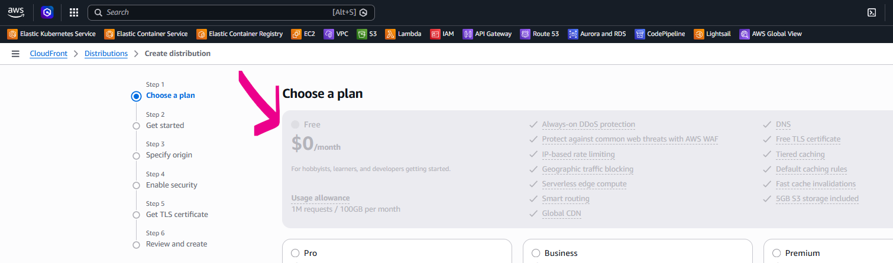  

---

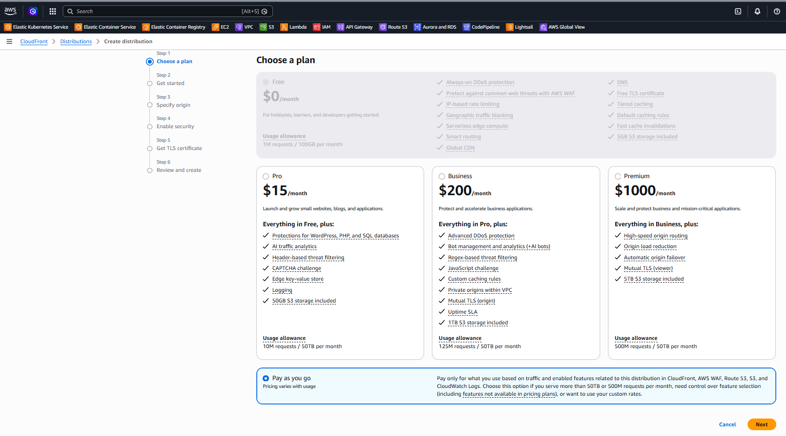   

---

**2.2 — Name the distribution**  
On the Get started screen, enter a name for your distribution (e.g. arch-static). Select Single website or app as the distribution type. You can leave the Domain section blank for now unless you already have a custom domain registered in Route 53.  

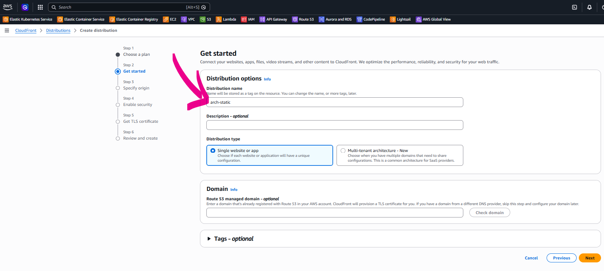  

--- 

**2.3 — Specify the S3 origin**  
On the Specify origin screen, set Origin type to Amazon S3. In the S3 origin field, type your bucket name or click Browse S3 to select it from a list. AWS will populate the full S3 endpoint automatically.   

Under Settings, check the box Allow private S3 bucket access to CloudFront (Recommended). This tells CloudFront to write a bucket policy that grants it read access to your private bucket — you do not need to make the bucket public. Leave Origin settings on Use recommended origin settings.   

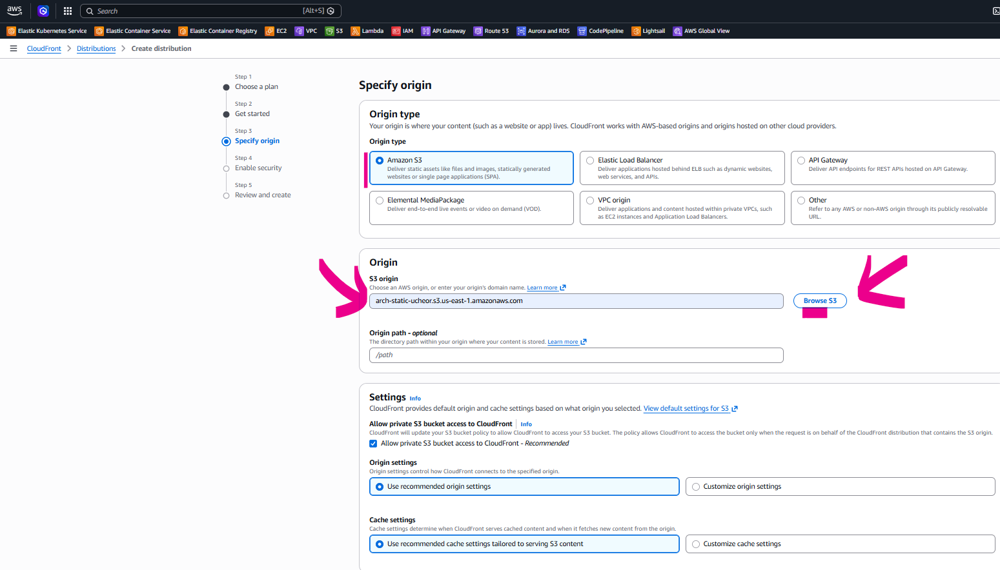   

---

**2.4 — Review and create**   
Continue through the Enable security step (leave Security protections as None for this demo). On the Review and create screen, verify the configuration — particularly that CloudFront access to your S3 origin is granted. Click Create distribution.   

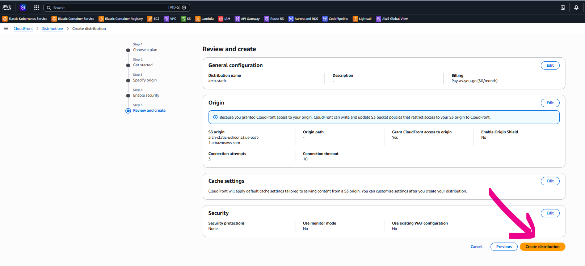   

---

CloudFront will now deploy your distribution. This typically takes a few minutes. Once deployed, you will see the distribution domain name (e.g. d17cw2vr5cfs8d.cloudfront.net) on the distribution detail page — note this down, as you will use it to access your site.   

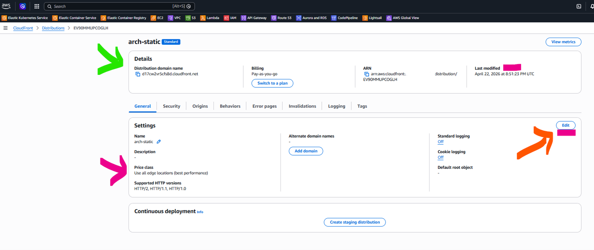   

---

**2.5 — Set the default root object**   
After the distribution is created, open its settings and click Edit. Scroll to the Default root object field and enter **index.html**. This tells CloudFront which file to serve when a visitor hits the root URL of your distribution (e.g. https://d17cw2vr5cfs8d.cloudfront.net/).  

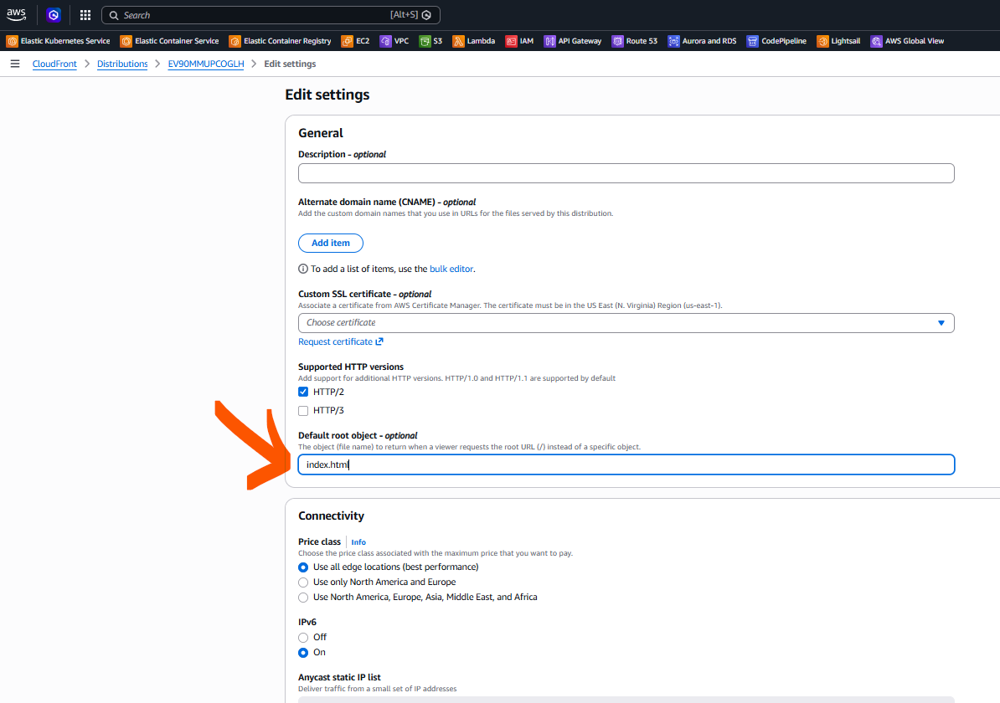  

---

Save the changes. CloudFront will automatically update the S3 bucket policy to allow only the CloudFront distribution to read from the bucket. You can verify this on the S3 bucket's Permissions tab.   

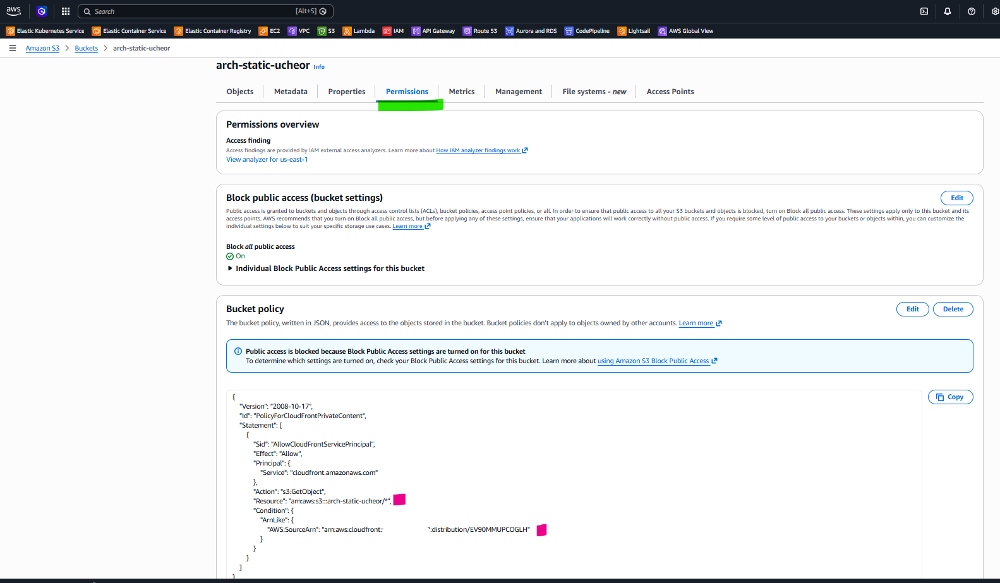   

You can also manually edit the bucket policy and adjust as needed. 

---

**Tip:** Keep Block all public access ON in S3. The bucket policy added by CloudFront uses a condition that restricts access to your specific distribution ARN, which is the secure approach. 

Although we are deploying a static website with public access, there is no need to keep S3 bucket open to public access in this situation since all traffic will be through our CloudFront distribution. 

## Step 3 — Set Up the IAM OIDC Identity Provider & Role   
Instead of generating a long-lived AWS Access Key and Secret and storing them in GitHub, we use OpenID Connect (OIDC). GitHub Actions can mint a short-lived JWT token for each workflow run, and AWS STS exchanges that token for temporary credentials scoped to a specific IAM role. This means no static secrets, ever.   

**3.1 — Create the GitHub OIDC Identity Provider (skip if already set up)**   
**Note:** If your AWS account already has token.actions.githubusercontent.com listed under IAM > Identity providers, skip to Step 3.2. You only need one OIDC provider per account, regardless of how many repositories you connect.  

In the AWS Console, open IAM and click Identity providers in the left menu.   

   

---

Click Add provider. Select OpenID Connect as the provider type. Enter the following values:   
•	Provider URL: https://token.actions.githubusercontent.com   
•	Audience: sts.amazonaws.com   

   

---

Click Add provider. You will see a success message confirming that token.actions.githubusercontent.com has been added.   

   

---

**3.2 — Create the IAM Role**   
Now that the identity provider exists, create an IAM role that GitHub Actions will assume. In IAM, click Roles in the left menu.   

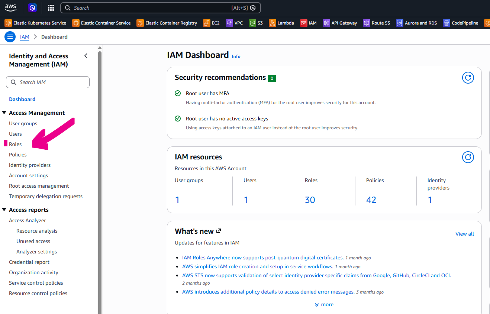   

---

Click Create role. On the Select trusted entity screen, choose Web identity. From the Identity provider dropdown, select **token.actions.githubusercontent.com**. Set the Audience to **sts.amazonaws.com**. Then fill in:   
•	**GitHub organization:** your GitHub username or org name   
•	**GitHub repository:** the name of your static site repository (optional for improved access control)   
•	**GitHub branch:** * (wildcard, or restrict to applicable branch for tighter control)    

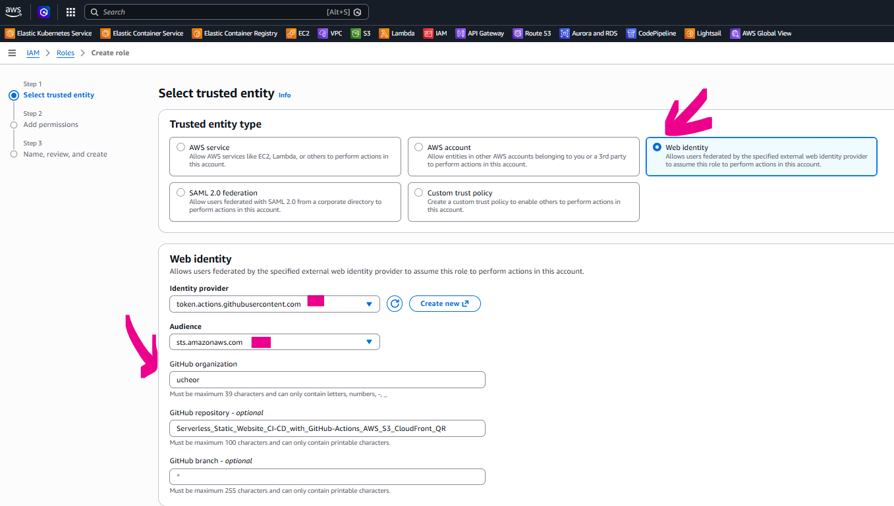   

---

**3.3 — Add permissions**   
Click Next to proceed to Add permissions. Search for and attach the following two AWS managed policies:   
•	**AmazonS3FullAccess** — allows the workflow to sync files to the S3 bucket   
•	**CloudFrontFullAccess** — allows the workflow to create CloudFront cache invalidations   

**Note:** Feel free to use custom policies to implement least priveledge and tighter control.   

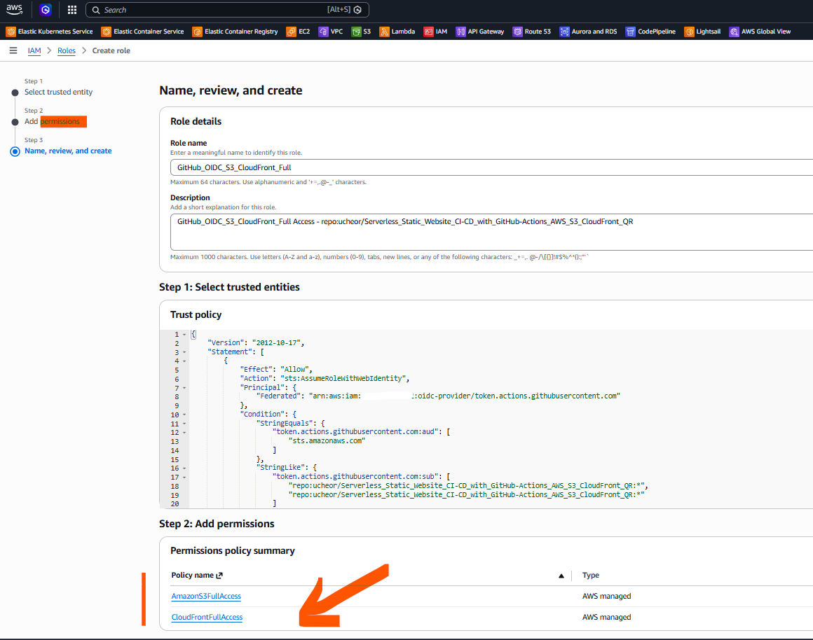   

---

Give the role a descriptive name such as GitHub_OIDC_S3_CloudFront_Full. Review the trust policy JSON (shown automatically) — it will contain a StringLike condition that restricts which repositories can assume this role. Click Create role.   

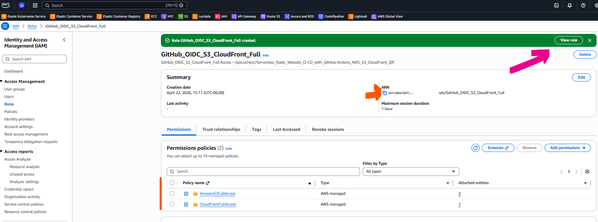   

---

**Note:** Scope your role to specific repositories using the StringLike condition on token.actions.githubusercontent.com:sub. Avoid using a wildcard * for the sub condition in production.

## Step 4 — Configure GitHub Actions Secrets  

Your GitHub Actions workflow needs four pieces of information to deploy to AWS. These are stored as encrypted repository secrets in GitHub so they are never exposed in your workflow file or logs.  

**4.1 — Add repository secrets**   
In your GitHub repository, go to Settings > Security and quality > Secrets and variables > Actions. Click New repository secret and add each of the following:  

•	**AWS_REGION** — the AWS region where your S3 bucket lives (e.g. us-east-1)  
•	**AWS_ROLE_ARN** — the full ARN of the IAM role created in Step 3 (e.g. arn:aws:iam::123456789012:role/GitHub_OIDC_S3_CloudFront_Full)  
•	**S3_BUCKET_NAME** — the name of your S3 bucket (e.g. my-static-site)  
•	**CLOUDFRONT_DISTRIBUTION_ID** — the distribution ID from Step 2 (e.g. EV90MMUPTPGLH)  

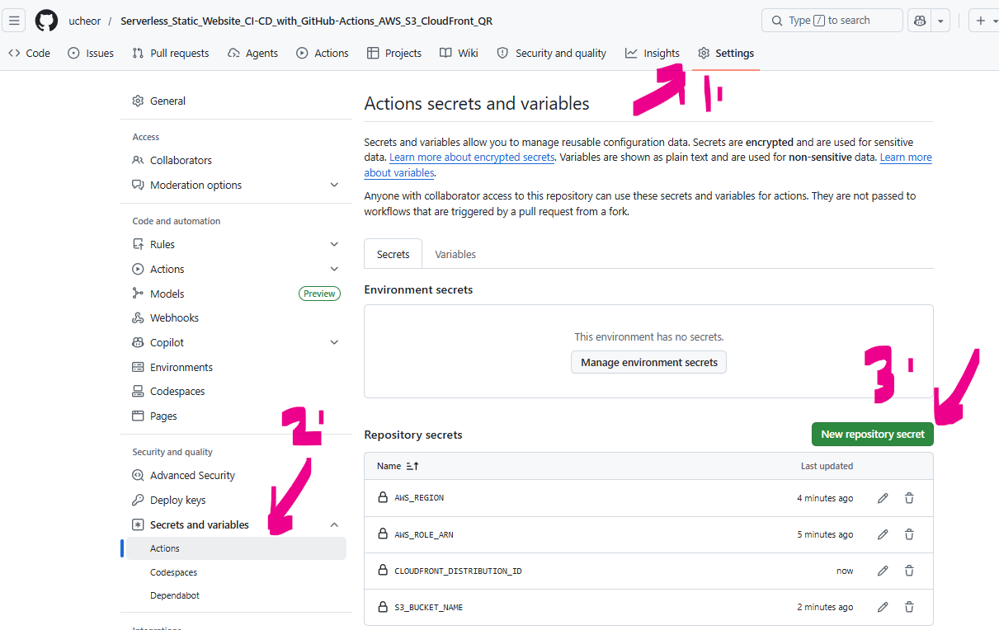  

---

**Tip:** Find your CloudFront Distribution ID on the distribution detail page in the AWS Console — it is the alphanumeric string shown next to the distribution domain name.

## Step 5 — Deploy  

With the infrastructure in place and the secrets configured, you are ready to trigger your first deployment. The GitHub Actions workflow will:  
-	Check out the repository code
-	Assume the IAM role via OIDC (no stored credentials)
-	Sync your website files to S3 using aws s3 sync
-	Invalidate the CloudFront cache so visitors immediately see the latest version

**5.1 — Workflow file structure**
Your repository should contain a workflow file at .github/workflows/arch.yml (or similar). 

```
name: Deploy

on:
  push:
    branches: [main]

env:
    AWS_ROLE_ARN: ${{ secrets.AWS_ROLE_ARN }}
    AWS_REGION: ${{ secrets.AWS_REGION }}
    S3_BUCKET_NAME: ${{ secrets.S3_BUCKET_NAME }}                           # example: arch-static-ucheor
    CLOUDFRONT_DISTRIBUTION_ID: ${{ secrets.CLOUDFRONT_DISTRIBUTION_ID }}   # example: EV90MMUPTYGLH
    

jobs:
  deploy:
    runs-on: ubuntu-latest
    permissions:
      id-token: write   # required for OIDC
      contents: read

    steps:
      - name: Checkout Git repository
        uses: actions/checkout@v4

      - name: Configure AWS credentials (OIDC)
        uses: aws-actions/configure-aws-credentials@v4
        with:
          role-to-assume: ${{ env.AWS_ROLE_ARN }}
          aws-region: ${{ env.AWS_REGION }}
      
      - name: Debug bucket name
        run: |
            echo "Bucket is: '${{ env.S3_BUCKET_NAME }}'"

      - name: Deploy to S3
        run: |
            aws s3 sync ./arch s3://${{ env.S3_BUCKET_NAME }} \
            --delete

      - name: Invalidate CloudFront
        run: |
            aws cloudfront create-invalidation \
            --distribution-id ${{ env.CLOUDFRONT_DISTRIBUTION_ID }} \
            --paths "/*"
```

---

At a minimum the workflow needs the following permissions block to enable OIDC token generation:

permissions:  
  id-token: write   # Required for OIDC  
  contents: read  

The deploy step will call aws sts assume-role-with-web-identity (handled automatically by the configure-aws-credentials action) and then run aws s3 sync and aws cloudfront create-invalidation using the values from your secrets.  

**5.2 — Push to GitHub**  
Add all your files, commit, and push to the main branch. This will trigger the workflow automatically.  

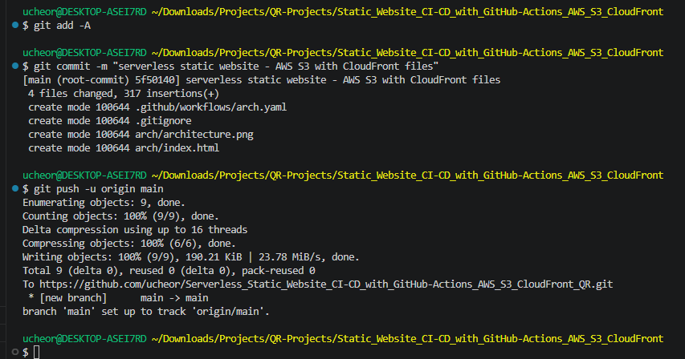  

---

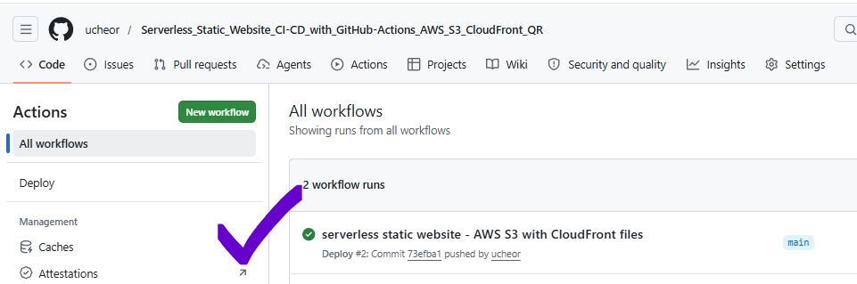   

---

Navigate to the Actions tab in your GitHub repository to watch the workflow run. Once it turns green, open your CloudFront distribution domain name in a browser — your static site is live! You might need to give it a few minutes to give the distribution time to get deployed to all edge locations.

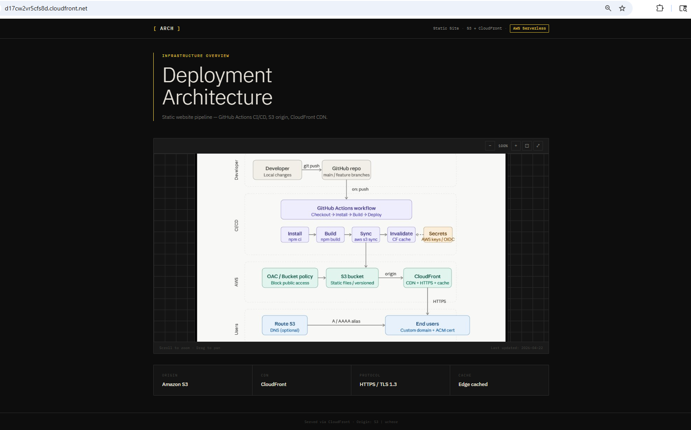

---

**Tip:** If the workflow fails with a credential error, double-check that the AWS_ROLE_ARN secret matches exactly and that the IAM trust policy contains your repository name. A common mistake is a trailing slash or incorrect casing in the repo path.  

**5.2 — Clean Up**

Congratulations on getting to this point. If you are done with your AWS resources, remember to circle back and delete resources you no longer need. This includes the S3 bucket, IAM roles, and Cloudfront Distribution. 

**Note:** that CloudFront distributions need to be disabled first before deleting. If your CloudFront distribution is a monthly subscription, you will need to disable it first and then delete at the end of your biling cycle. Pay-as-you-go distributions can be deleted whenever you wish. 

## Summary  
Here is a quick recap of what we built:  

•	**AWS S3 Bucket** — private storage for website files with versioning enabled  
•	**CloudFront Distribution** — global CDN with a private origin policy and index.html as the default root object  
•	**IAM OIDC Identity Provider** — trusted connection between GitHub Actions and AWS, no static keys required  
•	**IAM Role** — scoped to your specific GitHub repository, with S3 and CloudFront permissions  
•	**GitHub Actions Secrets** — four encrypted values that parameterise the deployment workflow  
•	**Automated CI/CD** — every push to main syncs your site to S3 and invalidates the CloudFront cache  

This architecture is fully serverless, costs very little at low traffic, and follows AWS security best practices by eliminating long-lived credentials. Enjoy your new automated deployment pipeline!  


Found this helpful? Like and repost to share with your network. Let me know if you have any questions!   

---

#AWS #CloudFront #S3 #GitHubActions #OIDC #DevOps #CI_CD #Serverless #StaticWebsite #Infrastructure  
